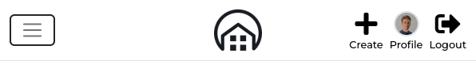

# Property Direct

Property Direct is a proof of concept property listing website targeted at the UK market. It aims to allow users to sell their homes in a peer-to-peer environment to avoid estate agent fees.

Registered sellers can list properties for sale, which can then be viewed by visitors. Enquires can be made about properties by registered users, who gain access to listing contact information by registering.
Registered sellers can edit properties they have created, to update information or delete the property to remove it from the marketplace.
All properties can be viewed by anonymous visitors, who can make use of search and filter functionality to narrow a search to match their criteria.

This is my 5th portfolio project developed as part of the Code Institute Diploma in Full Stack Development. It was created to demonstrate skills acquired using the Django REST Framework and React to develop the API and Frontend respectively.


## Demo

[Frontend - Deployment](https://ci-pp5-property-direct.herokuapp.com)

### API Project Links

- [API - Repository](https://github.com/ianmeigh/property-direct-backend)
- [API - Deployment](https://ci-pp5-property-direct-api.herokuapp.com)

## TOC

- [User Experience (UX)](#user-experience-ux)
  - [User Stories](#user-stories)
  - [Agile Methodology](#agile-methodology)
  - [Design](#design)
    - [Wireframes](#wireframes)
    - [Color Scheme](#color-scheme)
    - [Typography](#typography)
    - [Images and Iconography](#images-and-iconography)
- [Features](#features)
  - [Home Page](#home-page)
  - [Navigation](#navigation)
  - [Register (Sign up) / Login](#register-sign-up--login)
  - [Property Creation / Edit Form](#property-creation--edit-form)
  - [Property List View](#property-list-view)
  - [Property Detail View](#property-detail-view)
  - [Property Search Form](#property-search-form)
  - [Note Creation, Editing and Deletion](#note-creation-editing-and-deletion)
  - [Bookmarks](#bookmarks)
  - [Top Sellers and Following Users](#top-sellers-and-following-users)
  - [Profile](#profile)
  - [Profile Edit Form](#profile-edit-form)
  - [Username and Password Edit Forms](#username-and-password-edit-forms)
  - [Components](#components)
    - [Components used in this application](#components-used-in-this-application)
  - [Features Not Implemented](#features-not-implemented)
  - [Future Features](#future-features)
- [Testing](#testing)
  - [Bugs](#bugs)
    - [Fixed Bugs](#fixed-bugs)
    - [Remaining Bugs](#remaining-bugs)
- [Technologies Used](#technologies-used)
  - [Languages and Frameworks Used](#languages-and-frameworks-used)
  - [Node Packages / Dependencies Used](#node-packages--dependencies-used)
  - [Programs and Tools Used](#programs-and-tools-used)
- [Deployment](#deployment)
  - [Forking the GitHub Repository](#forking-the-github-repository)
  - [Making a Local Clone](#making-a-local-clone)
  - [Deploying with Heroku](#deploying-with-heroku)
  - [Linking with the API/backend](#linking-with-the-apibackend)
- [Credits](#credits)
  - [Code](#code)
  - [Media](#media)
  - [Acknowledgments](#acknowledgments)

## User Experience (UX)

The initial aims of the project, which formed the basis for user story creation, were to produce a web application that allows registered users to list their property for sale, and search for properties available for purchase in their local area. Key goals for the site were identified as below and used to construct user stories:

- Create a property listing site where users can list properties for sale.
- Allow users to search for properties within a defined area and using a range of filters.
- Allow properties to be saved for future review.
- Allow popular sellers to be followed so new listings can be seen via a newsfeed.
- Registered users can leave private notes on a property listed to document viewings or reminders.
- Site Owners can create / edit / delete Articles to assist with home buying
- Registered users can read and comment on articles

### User Stories

All User Stories can be viewed as [Issues](https://github.com/ianmeigh/property-direct-frontend/issues) in the projects GitHub Repository and have been mapped to Epics on the projects [Kanban board](https://github.com/users/ianmeigh/projects/1/views/7).
Acceptance criteria for each user story can be viewed by opening each User Story on the projects Kanban Board (linked above) or from the table view [here](https://github.com/users/ianmeigh/projects/1/views/5). Alternatively all User Stories can be found in a separate readme file [here](USERSTORIES.md).

### Agile Methodology

An Agile Methodology was employed to manage the development of this project. GitHub Projects was used to create User Stories as Issues, each with acceptance criteria and tasks. User Stories were then grouped into Milestones to represent the Epics each belong to and assigned a priority using the MOSCOW prioritization technique.

User Stories were then assigned to 1 of the 5 planned Sprints (or Iterations) to cover the main development phase of the project. The projects Kanban board can be viewed [here](https://github.com/users/ianmeigh/projects/1/views/7).

Pull requests were linked with a user story when they contributed to completion of the acceptance criteria.

### Design

#### Wireframes

Wireframes were created to visualize the layout of the site and as a reference when translating those designs to the final product. Care was taken at this stage to consider a layout that would work well across a diverse range of viewports. Desktop and Mobile wireframes can be viewed using the links below:

- [Wireframes for Home Page](docs/assets/home_page.png)
- [Wireframes for Create Property Page](docs/assets/create_property_page.png)
- [Wireframes for Property Detail](docs/assets/profile_page.png)
- [Wireframes for Profile Page](docs/assets/property_detail.png)

#### Color Scheme

Minimal color has been used throughout the site taking inspiration from other property websites to keep the content clear and minimize distraction.

The background surrounding content on larger viewports is a light grey used to make the content stand out.

Blue (rgb(14, 107, 168)) was chosen as the color of primary buttons due to its positive psychological association with Trust, Dependability and Security. These traits were deemed important to the sites brand as users are dealing with strangers and potentially large sums of money.


#### Typography

Google fonts was used in this project with both fonts selected for their legibility and simplicity:

[Montserrat](https://fonts.google.com/specimen/Montserrat) - Use in headings. [Lato](https://fonts.google.com/specimen/Lato) - Use in paragraphs and labels.

#### Images and Iconography

The site logo was sourced from [freepik](https://www.freepik.com). Please refer to the [Credits section](#credits) for more detail.

## Features

### Home Page

- The home page serves as the entrypoint for the site.
- It contains the navigation bar, a list of properties, and the search bar so users can interact with site content straight away.
- User Stories covered:
[6](https://github.com/ianmeigh/property-direct-frontend/issues/6),
[14](https://github.com/ianmeigh/property-direct-frontend/issues/14),
[25](https://github.com/ianmeigh/property-direct-frontend/issues/25),
[34](https://github.com/ianmeigh/property-direct-frontend/issues/34).


### Navigation

- The navigation bar features on all pages of the site.
- It was designed to be responsive and displays different links to visitors based on authentication state.
  - If a user is authenticated as a Seller, they can see links to create a property listing, view bookmarked (saved) properties, view their property feed (property listed by other sellers they have followed), a link to their profile and the option to logout.
  - If a user is logged in and they are not a seller they see all the options previously mentioned with the exception of the link to create a property listing.
  - Anonymous visitors see links to login or register (sign up).
- When viewed on smaller viewport all options are listed in a hamburger menu on the left of the navbar, which opens an bootstrap offCanvas element.
  - Key site feature are duplicated on the right for quick access.
- User Stories covered:
[6](https://github.com/ianmeigh/property-direct-frontend/issues/6),
[7](https://github.com/ianmeigh/property-direct-frontend/issues/7),
[8](https://github.com/ianmeigh/property-direct-frontend/issues/8),
[9](https://github.com/ianmeigh/property-direct-frontend/issues/9),
[11](https://github.com/ianmeigh/property-direct-frontend/issues/11).





### Register (Sign up) / Login

- Visitors can register for an account which allows them to create listings, bookmark properties, maintain a profile and view property listing contact information.
- If visitors want to be able to list properties they must indicate so during registration by selecting the checkbox labeled "Are you selling property?". This allows access to create property listings.
- A unique username must be provided with a password. The password must be entered twice to minimize the possibility of incorrectly entering the chosen password.
- When registration is complete, the user is redirected to the login page so they can use their new credentials to authenticate.
- User Stories covered:
[7](https://github.com/ianmeigh/property-direct-frontend/issues/7),
[8](https://github.com/ianmeigh/property-direct-frontend/issues/8).


### Property Creation / Edit Form

- Users registered as sellers have access to create property listings which advertise property for sale.
- This form is used both when creating a property listing and when editing an existing property.
- User can upload an image to represent the property listing, a floorplan and an energy performance certificate.
- Other property details can be entered in the form fields to provide more detail about the property such as location, property type and its features (garden and/or dedicated parking).
- Certain fields are mandatory and the postcode entered will be verified by the API to ensure it is a valid UK postcode with feedback presented to the user if this verification check fails.
- If no property image is provided a default placeholder image will be used until one is provided by the user.
- User Stories covered:
[12](https://github.com/ianmeigh/property-direct-frontend/issues/12),
[16](https://github.com/ianmeigh/property-direct-frontend/issues/16).


### Property List View

- This view is shown on the Home, Bookmarks, Feed and Seller Profile pages (the latter views have filters applied to the API request).
- The compact property detail shown has been deigned to be responsive with the information layout shifting based on the viewport size for maximum information clarity.
- Clicking the property image of the more detail link will open the property detail page and users can bookmark properties directly from the list view using the bookmark Icon.
- Contact information can also be revealed in this view (if users are authenticated) so users can quickly get access to the information they require.
- Seller information is available through the avatar below the property image and links to the sellers profile so users discover more information about them.
- User Stories covered:
[14](https://github.com/ianmeigh/property-direct-frontend/issues/14),
[18](https://github.com/ianmeigh/property-direct-frontend/issues/18),
[19](https://github.com/ianmeigh/property-direct-frontend/issues/19),
[20](https://github.com/ianmeigh/property-direct-frontend/issues/20),
[37](https://github.com/ianmeigh/property-direct-frontend/issues/37).


### Property Detail View

- Detailed view of a single property record containing the full description and key property information.
- Here the Floorplan and EPC images (if added during property creation) can be viewed.
- A map (Google Maps) of the local area surrounding the property is displayed with the approximate location of the property pinned. This allows users to explore the surrounding area.
- Private Notes can be added to properties to allow users to make observations and notes for future review (e.g. questions to ask the agent or viewing details).
- Contact information can be revealed in this view (if users are authenticated) and the bookmark icon is also available so users can add or remove the property to/from their bookmarks.
- Seller information is available through the avatar below the property image and links to the sellers profile so users discover more information about them.
- If the owner of the property listing views the property detail, a more actions menu will be displayed allowing them to edit the listing or delete it.
- User Stories covered:
[16](https://github.com/ianmeigh/property-direct-frontend/issues/16),
[17](https://github.com/ianmeigh/property-direct-frontend/issues/17),
[18](https://github.com/ianmeigh/property-direct-frontend/issues/18),
[19](https://github.com/ianmeigh/property-direct-frontend/issues/19),
[21](https://github.com/ianmeigh/property-direct-frontend/issues/21).


### Property Search Form

- A postcode can be entered which acts as a point of origin coupled with a search radius. This information is used to narrow the results to only properties that fall within the specified distance from the postcode.
- The postcode entered will be verified by the API to ensure it is a valid UK postcode with feedback presented to the user if this verification check fails.
- Postcode search results display an additional field that isn't present on the standard list view. The additional field displays the distance of the result from the point of origin.
- Filters can be used to narrow the list of properties based on criteria such as price range, property type etc. Filters can be used separately in conjunction with the postcode search to narrow results to better match the users preferences.
- Filters can be cleared separately or the entries search can be cleared to show all properties.
- If no results are found users are prompted to adjust search criteria.
- User Stories covered:
[25](https://github.com/ianmeigh/property-direct-frontend/issues/25).


### Note Creation, Editing and Deletion

- Authenticated users can leave private Notes on property listings to record observations and notes for future review (e.g. questions to ask the agent or viewing details).
- Existing property notes can be edited or deleted by the owner from the more action menu next to each note.
- User Stories covered:
[21](https://github.com/ianmeigh/property-direct-frontend/issues/21),
[22](https://github.com/ianmeigh/property-direct-frontend/issues/22),
[23](https://github.com/ianmeigh/property-direct-frontend/issues/23),
[24](https://github.com/ianmeigh/property-direct-frontend/issues/24).


### Bookmarks

- Bookmarks allow users to save properties so they can be revisited at another time in their own view.
- The bookmark icon is an outline when a property has not been bookmarked, and turns solid when it has been bookmarked.
- This allows users to see what properties they have previously saved when viewing the property list.
- User Stories covered:
[18](https://github.com/ianmeigh/property-direct-frontend/issues/18),
[19](https://github.com/ianmeigh/property-direct-frontend/issues/19).


### Top Sellers and Following Users

- Displays the most followed sellers.
- Allows authenticated users to follow and unfollow sellers and visit their profiles to learn more about them.
- Uses a bootstrap accordion so the information can be collapsed. This feature will become more useful in future versions when popular properties are displayed as another accordion item.
- Accordion item is expanded on larger viewport but is collapsed when viewing the site on mobile to reduce the amount of screen space used but keep the information available if a user is interested.
- User Stories covered:
[#34](https://github.com/ianmeigh/property-direct-frontend/issues/34)
[#35](https://github.com/ianmeigh/property-direct-frontend/issues/35)
[#36](https://github.com/ianmeigh/property-direct-frontend/issues/36)


### Profile

- Profile pages for seller accounts are public and can be viewed by all users.
- Standard user profiles can only be viewed by the profile owner.
- Profile owners can edit their profiles allowing them to add a description and avatar image to present their brand to other users.
- Contact information is required when editing a profile which will appear on property listings.
- In addition to editing a profile, users can change their password and username.
- Sellers can see how many properties they have listed, how many users are following them and how many other sellers they are following.
- Users can see how many sellers they are following.
- Sellers will also see a feed of all the properties they have listed on their profile page to make it easier to manage everything they have listed.
- User Stories covered:
[18](https://github.com/ianmeigh/property-direct-frontend/issues/18),
[#26](https://github.com/ianmeigh/property-direct-frontend/issues/26),
[#27](https://github.com/ianmeigh/property-direct-frontend/issues/27),
[#28](https://github.com/ianmeigh/property-direct-frontend/issues/28),
[#29](https://github.com/ianmeigh/property-direct-frontend/issues/29),
[#30](https://github.com/ianmeigh/property-direct-frontend/issues/30),
[#31](https://github.com/ianmeigh/property-direct-frontend/issues/31),
[#32](https://github.com/ianmeigh/property-direct-frontend/issues/32),
[#33](https://github.com/ianmeigh/property-direct-frontend/issues/33).


### Profile Edit Form

- Profile owners can edit their profiles allowing them to add a description and avatar image to present their brand to other users.
- Contact information is required when editing a profile which will appear on property listings.
- User Stories covered:
[#31](https://github.com/ianmeigh/property-direct-frontend/issues/31).


### Username and Password Edit Forms

- Allows users to manage their account password and username (the latter is useful if a brand changes it names).
- User Stories covered:
[#32](https://github.com/ianmeigh/property-direct-frontend/issues/32),
[#33](https://github.com/ianmeigh/property-direct-frontend/issues/33).


### Components

Components in ReactJS are independent and reusable blocks of code that simplify developments by allowing a developer to break a user interface into elements that can reused across one or multiple applications. This benefits development teams by reducing code duplication and complexity when managing a large code base (update the component once rather than each pages that utilises that feature).

Components can also be updated independently, so errors in one component can be managed in that component and not cause the entire page to fail loading.

A number of components were created during the development of this project and are highlighted below. Benefits common to all components are:

- Ease of development by consolidating code into a single re-usable component that could be used in different parts of the application and debugged by modifying code in a single location.
- Allowed for consistent user experience across pages without code duplication and the complexities of managing duplicated code.

#### Components used in this application

- Asset
  - Used to display a loading spinner, upload image (planned to be used when multiple image uploads are introduced to the site in future versions) and a message when search filters return no results.
  - UX (user experience) is improved by the loading spinner as users are notified when content is being fetched by the application, rather then being presented with a blank or partially complete page while data is loaded.
  - UX is improved by the feedback provided to users when a search returns no results as this provides feedback and prompts them to adjust their search criteria.

- Avatar
  - Used to display the user avatar in different variations throughout the site (based on use and viewport size).
  - UX experience is improved as users can quickly identify the author of posts and their authentication state.

- Contact Information Button
  - This component is used to display contact information about each property. The component is displayed in different parts of the property pages determined by viewport size.

- Map
  - The Map component requires the creation of a center point based on the Longitude and Latitude of a property (information which is provided by the API). It was very simple to achieve this by creating a component that accepted these values as arguments (props) and then returns the Map.
  - A third party package to make use of the Google Maps JavaScript API in React components. The packaged used for this has to be switched early in development due to compatibility issues, because it had been created as a component the code was much easier to maintain than having to modify the much larger property detail view.

- More Actions Dropdown
  - This component was used on the profile, property detail and note components to present options for object editing and deletion.
  - UX was improved by presenting a consistent menu throughout the site while allowing for different functionality by passing handler functions as arguments (props) to the component.

- NavBar
  - The navigation bar appears on every page and contributes to an improved user experience by providing users to access the majority of site functionality in a consistent way.
  - The Navbar component displays different links and layouts based on authentication state and as such contains a lot of conditional logic. To not have to duplicate this code across each page and have a reusable component saved time and effort during the development cycle.

- NotFound
  - This component is displayed when a user navigates to a resource that doesn't exist.
  - It improves the user experience by providing feedback when an error has occurred and allowing the NavBar to remain accessible so they can continue to use the site.

### Features Not Implemented

Due to project time constraints the following features were not implemented for this release and are planned as future features:

- Articles
  - Article creation (editing, etc.) would have been limited to site owners so they could share information relevant to property sales and website usage. A complete set of users stories were created for this feature at the outset of the project.
  - Planned User Stories:
[39](https://github.com/ianmeigh/property-direct-frontend/issues/39),
[40](https://github.com/ianmeigh/property-direct-frontend/issues/40),
[41](https://github.com/ianmeigh/property-direct-frontend/issues/41),
[42](https://github.com/ianmeigh/property-direct-frontend/issues/42),
[43](https://github.com/ianmeigh/property-direct-frontend/issues/43),
[44](https://github.com/ianmeigh/property-direct-frontend/issues/44).

- Comments
  - Comments were planned for the articles so users could share their opinions which would ultimately assist the site owner when creating content in the future.
  - Planned User Stories:
[45](https://github.com/ianmeigh/property-direct-frontend/issues/45),
[46](https://github.com/ianmeigh/property-direct-frontend/issues/46),
[47](https://github.com/ianmeigh/property-direct-frontend/issues/47).

### Future Features

- Multiple Image Upload for property images
  - Allow sellers to provide more detail for users about the property.
- Search for Sellers in a search filter.
  - You can find a seller on the site if you have seen a property sign and want to look up the seller to help find it.
- Popular properties - API code exists but didn't have time to implement.
  - This would promote popular properties on the site, draw more user visits and let sellers know how popular their properties are.
- Articles and Comments.
  - Allow the site owner to communicate information with users and gather feedback in the form of comments.
- Area search and search autocomplete rather than postcode.
  - Allows users to search when they are not sure of a postcode and would make the site easier to use.
- Automatic Image resizing and format conversion.
  - Improve mobile load times by reducing image size and serving the content in more appropriate formats.

## Testing

Separate testing documentation can be viewed [here](TESTING.md).

### Bugs

#### Fixed Bugs

Please see the [click here](https://github.com/ianmeigh/property-direct-frontend/search?q=fix+NOT+merge&type=commits) to view a list of bug fixes for this project.

#### Remaining Bugs

No known remaining bugs.

## Technologies Used

### Languages and Frameworks Used

- HTML
- CSS
- Javascript
- React - (Front-end JavaScript library for building user interfaces based on UI components)

### Node Packages / Dependencies Used

- [React Bootstrap](https://react-bootstrap.github.io/) - Component-based library that provides native Bootstrap components as pure React components[1](https://www.pluralsight.com/guides/how-to-set-up-a-react-bootstrap-app). Used to create a responsive application/component UI.
- [Axios](https://axios-http.com/) - Promise based HTTP client for the browser and node.js. Used to make HTTP requests from throughout the application.
- [jwt-decode](https://github.com/auth0/jwt-decode) - Used to decode and extract information from a JWT token.
- react-router-dom - Routing library for the React Javascript library. Used to display different components based on the URL entered in the browser.
- [react-google-maps/api](https://react-google-maps-api-docs.netlify.app/) - Provides bindings to the Google Maps JavaScript API (v3) and lets it be used in applications as React components. Used to display a map of the local area on the property page.
- [react-infinite-scroll-component](https://github.com/ankeetmaini/react-infinite-scroll-component) - Component which manages the loading of paginated content. Used to automatically load more content as the user browses site content.
- [react-textarea-autosize](https://github.com/Andarist/react-textarea-autosize) - A replacement for the textarea component that automatically resizes. Used to improve the user experience as they create notes.

### Programs and Tools Used

- [drawSQL](https://drawsql.app/) - Create Database Schema/ERD
- [Visual Studio Code:](https://code.visualstudio.com/)
  - Visual Studio Code was used as my code editor for this project. A full list
    of plugins used can be found later in this section.
- [Git](https://git-scm.com/)
  - Git was used for version control, using the terminal to commit to Git and
    Push to GitHub.
- [GitHub:](https://github.com/)
  - GitHub is used to store the projects code after being pushed from Git.
- The following modules were installed or enabled in [Visual Studio
Code](https://code.visualstudio.com/) to assist with formatting and code
linting:
  - [ESLint](https://eslint.org/) - Code Linter.
  - [Prettier](https://prettier.io/) - Code Formatting.
- The following [Visual Studio Code](https://code.visualstudio.com/) extensions
  were utilized in the production of this project:
  - [Rewrap](https://marketplace.visualstudio.com/items?itemName=stkb.rewrap) - Used to wrap comments.
  - [Code Spell Checker](https://marketplace.visualstudio.com/items?itemName=streetsidesoftware.code-spell-checker) - Used to spell check content and commits.
  - [indent-rainbow](https://marketplace.visualstudio.com/items?itemName=oderwat.indent-rainbow) - Makes indentation easier to read.
  - [markdownlint](https://marketplace.visualstudio.com/items?itemName=DavidAnson.vscode-markdownlint) - Markdown linting and style checking for Visual Studio Code.
  - [autoDocstring](https://marketplace.visualstudio.com/items?itemName=njpwerner.autodocstring) - Generates python docstrings templates automatically
  - [TODO Highlight](https://marketplace.visualstudio.com/items?itemName=wayou.vscode-todo-highlight) - highlight TODOs, FIXMEs, and any keywords, annotations.
  - [Todo Tree](https://marketplace.visualstudio.com/items?itemName=Gruntfuggly.todo-tree) - Show TODO, FIXME, etc. comment tags in a tree view

## Deployment

### Forking the GitHub Repository

By forking the GitHub Repository we make a copy of the original repository on
our GitHub account to view and/or make changes without affecting the original
repository by using the following steps...

1. Log in to GitHub and locate the [GitHub
   Repository](https://github.com/ianmeigh/property-direct-backend)
1. At the top of the Repository (not top of page) just above the "Settings"
   Button on the menu, locate the "Fork" Button.
1. Click the button (not the number to the right) and you should now have a copy
   of the original repository in your GitHub account.

### Making a Local Clone

**NOTE**: It is a requirement of the project that you have Python version 3.8 or higher installed locally.

1. Log in to GitHub and locate the [GitHub Repository](https://github.com/ianmeigh/property-direct-backend).
1. Under the repository name, click "Code".
1. To clone the repository using HTTPS, under "HTTPS", copy the link.
1. Open your local terminal with git installed
1. Change the current working directory to the location where you want the cloned directory to be created.
1. Type `git clone`, and then paste the URL you copied in Step 3.

    ```console
    ~$ git clone https://github.com/ianmeigh/property-direct-backend.git
    ```

1. Press Enter. Your local clone will be created.

    ```console
    $ git clone https://github.com/ianmeigh/property-direct-backend.git
    > Cloning into `test-dir`...
    > remote: Counting objects: 10, done.
    > remote: Compressing objects: 100% (8/8), done.
    > remove: Total 10 (delta 1), reused 10 (delta 1)
    > Unpacking objects: 100% (10/10), done.
    ```

    [Click here](https://help.github.com/en/github/creating-cloning-and-archiving-repositories/cloning-a-repository#cloning-a-repository-to-github-desktop) for a more detailed explanation of the process above with pictures.

1. Change the current working directory to the cloned project folder (this will be a child directory in the location you cloned the project).

1. This guide assumes you have Node.js and npm installed locally, if this is not the case please install these now.
1. From the terminal run the command `npm install` to install all project dependencies.
1. Run the command `npm start` to run the application.

### Deploying with Heroku

**NOTE**: It is a prerequisite of deployment to Heroku that you already have access to the following:

- A Google Maps JavaScript API key.

**NOTE**: It is assumed you have followed all deployment instructions listed in this readme starting with the section titled 'Forking the GitHub Repository'.

1. Log in to [Heroku](https://www.heroku.com/) and if not taken there automatically, navigate to your personal app dashboard.
2. At the top of the page locate the 'New' drop down, click it and then select 'Create new app'.
3. Give your application a unique name, select a region appropriate to your location and click the 'Create app' button.
4. Your app should now be created. From the menu towards the top of the page select the 'Settings' section and click 'Reveal Config Vars' in the Config vars section. Enter the following key / value pairings:
    1. Key as `REACT_APP_MAPS_API` and the value as your Google Maps JavaScript API key. Click the Add button.
5. Navigate to the 'Deploy' page using the menu towards the top of the page.
6. Select 'GitHub' from the 'Deployment method' section and you will be prompted to 'Connect to GitHub'.
7. Once connected to your GitHub account you will be able to search for your repository which contains the forked 'Support-Hub' repository.
8. Once the repository is found click 'Connect'.
9. At the bottom of the page find the section named 'Manual deploy', select the 'main' branch in the drop down and click the 'Deploy' button.
10. Once deployment is complete, click the 'View' button to load the URL of the deployed application.

### Linking with the API/backend

You will need to ensure you have set the `axios.defaults.baseURL` in the `api/axiosDefaults.jsx` file to the url of your deployed version of th API.
You should then update the `CLIENT_ORIGIN` config variable in your deployed version of the API to ensure you will be able to make authenticated requests to this API.

## Credits

### Code

- The Moments tutorial produced by Code institute is credited throughout this project as it was used to create the foundations on which I built upon to create my project.
- [React documentation](https://reactjs.org/docs/getting-started.html) - Was used throughout development to gain a better understanding of Hooks.
- [React Bootstrap documentation and examples](https://react-bootstrap.github.io/components/alerts) - Used as a reference when building responsive component layouts.

### Media

- The [site logo](https://www.freepik.com/free-vector/elegant-real-estate-logos_1061402.htm) - Image by 'starline' on [Freepik](https://www.freepik.com/free-vector/elegant-real-estate-logos_1061402.htm)

- Property Images for demo property content and user avatars were taken from [unsplash](https://unsplash.com/).

### Acknowledgments

As always a huge thank you to my mentor Okwudiri Okoro and the Code Institute Slack community members Joanne Lee, Daisy McGirr, Mr Bim, John Bachitger and Tom Ainsworth for their advice and support during the development of this project.

Special thanks go to partner for her patience and support throughout this project.
