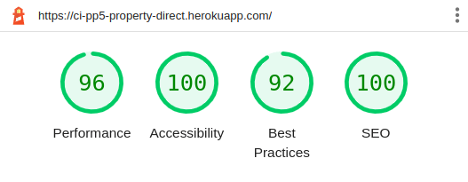
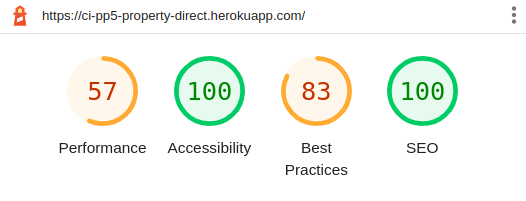

# Testing

## TOC

- [User Story Testing](#user-story-testing)
  - [Navigation](#navigation)
  - [Authentication](#authentication)
  - [Property](#property)
  - [Profile and Account Management](#profile-and-account-management)
- [Code Validation](#code-validation)
  - [JSX](#jsx)
  - [CSS](#css)
  - [Lighthouse Scores](#lighthouse-scores)
  - [Devices used for manual testing](#devices-used-for-manual-testing)

## User Story Testing

These tests were carried out when a feature was completed and committed during development. They have also been carried out against the deployed version of the site, the results of which are displayed below.

In addition to the test detailed below, all site URL's were tested to ensure they took users to the correct page.

### Navigation

#### User Story [#6](https://github.com/ianmeigh/property-direct-frontend/issues/6)

_As a_ **User**, _I can_ **view the navigation bar on every page** _so that_ **I can easily navigate the site and know my current location in the site structure**.

| Test # | Test | Outcome | Result |
|---|---|---|---|
| 1 | The navigation bar should be visible on every page and inform users of their current location in the site structure. | NavBar is displayed at the top of every page. | PASS |
| 2 | The navigation bar should present a different layout suited to the screen size it is being viewed from. | NavBar is responsive on different viewport. | PASS |
| 3 | All links are accurate and take users to the expected resource. | No broken links and all link to the expected URL. | PASS |
| 4 | Appropriate links are displayed to users based on their account type. | Create property link hidden from standard users. | PASS |

### Authentication

#### User Story [#7](https://github.com/ianmeigh/property-direct-frontend/issues/7)

_As a_ **User**, _I can_ **register for a new account** _so that_ **I can use the service to list and/or browse properties**.

| Test # | Test | Outcome | Result |
|---|---|---|---|
| 1 | Users can register with a unique username and a password. | Confirmed username must be unique | PASS |
| 2 | Users can optionally check a box to create a seller account. | Checkbox functions as expected and information is passed to the API| PASS |
| 3 | Confirm user account has been created by the API upon successful form submission. | User account confirmed created in the database. | PASS |

#### User Story [#8](https://github.com/ianmeigh/property-direct-frontend/issues/8)

_As a_ **User**, _I can_ **log in to my account** _so that_ **I can use the service using my existing credentials**.

| Test # | Test | Outcome | Result |
|---|---|---|---|
| 1 | Users can sign in using the credentials they used to sign up. | Using correct credentials results in the successful login. | PASS |
| 2 | Login errors are reported to the user. | If an incorrect username or password is entered this is reported to the user on the login form. | PASS |

#### User Story [#9](https://github.com/ianmeigh/property-direct-frontend/issues/9)

_As a_ **User**, _I can_ **log out of my account** _so that_ **I can keep my account secure on shared devices**.

| Test # | Test | Outcome | Result |
|---|---|---|---|
| 1 | Users can log out and end their session using a link on the navigation bar. | Logout link sends logout request to API as expected. | PASS |
| 2 | User session is cleared. | User is no longer able to access restricted pages. | PASS |
| 3 | Local storage is cleared of JWT token expiry information. | Local storage is successfully cleared. | PASS |

#### User Story [#10](https://github.com/ianmeigh/property-direct-frontend/issues/10)

_As a_ **User**, _I can_ **maintain my logged-in status until I decide to logout (or 24 hours passes since last activity)** _so that_ **I can use the site without interruptions and unexpected behaviour**.

| Test # | Test | Outcome | Result |
|---|---|---|---|
| 1 | Logged in and waited 10 minutes (to ensure user token has expired) before browsing to restricted resource (profile or property creation page). | Restricted page loads as expected. | PASS |

### Property

#### User Story [#12](https://github.com/ianmeigh/property-direct-frontend/issues/12)

_As a_ **User (Seller)**, _I can_ **create a property listing** _so that_ **others can view my listing, make enquires and I can sell my property**.

| Test # | Test | Outcome | Result |
|---|---|---|---|
| 1 | Property creation form can be viewed by authenticated sellers. | Form is visible when selecting the create property URL | PASS |
| 2 | Property creation form cannot be viewed by anonymous visitors or standard user accounts. |  | PASS |
| 3 | A valid postcode must be entered during property creation. |  | PASS |
| 4 | Fields which have validation report errors to the user. | Submitted a blank form and was shown field validation errors, once all fields showing an error had been corrected form submission worked as expected. | PASS |
| 5 | Images must be less that 2MB in size. | Attempted to submit form with images over 2MB and received validation error. | PASS |
| 6 | Images must have a height and width less than 4096px. | Attempted to submit form with an image height and width in excess of the limit (4096px) and received validation error. | PASS |
| 7 | Successful form submission results in a record being created by the API. | Property listing created in the database. | PASS |

#### User Story [#14](https://github.com/ianmeigh/property-direct-frontend/issues/14)

_As a_ **User**, _I can_ **view all property listings** _so that_ **I can see what is available on the marketplace**.

| Test # | Test | Outcome | Result |
|---|---|---|---|
| 1 | Home page displays all property listings in a single list view. | All properties displayed as expected, ordered by creation. | PASS |

#### User Story [#13](https://github.com/ianmeigh/property-direct-frontend/issues/13)

_As a_ **User**, _I can_ **view an individual property** _so that_ **I can see more details, check suitability and make enquires**.

| Test # | Test | Outcome | Result |
|---|---|---|---|
| 1 | Clicking a property images or the more details link, from the list view, will load the individual property page. | Property detail page loads as expected. | PASS |
| 2 | Property detail page displays information relevant to the selected property. | All information matches the property selected and the map loads with the correct location. | PASS |

#### User Story [#16](https://github.com/ianmeigh/property-direct-frontend/issues/16)

_As a_ **User (Seller)**, _I can_ **edit a property listing** _so that_ **I can update information or mark the property as sold**.

| Test # | Test | Outcome | Result |
|---|---|---|---|
| 1 | A property can be edited using a link within the individual property view. | When logged in as the property owner the more actions component is visible and the edit form loads when the menu action is selected. | PASS |
| 2 | A property listing will be displayed in an editable format with existing information populated. | All current property information is populated. | PASS |
| 3 | The edit can be cancelled, which will return the user to the previous page. | Cancelling the form returns the user to the previous page (property detail view). | PASS |
| 4 | When saved, the information in the listing will be updated to reflect any changes made. | Information that has been changed (images, form field information) is updated in the detail view when the form is submitted and is updated in the database by the API | PASS |
| 5 | Updating a property's postcode results in the map being updated | Confirmed that the longitude and latitude is recalculated and the map is updated. | PASS |

#### User Story [#17](https://github.com/ianmeigh/property-direct-frontend/issues/17)

_As a_ **User (Seller)**, _I can_ **delete a property listing** _so that_ **I can remove my property from the marketplace**.

| Test # | Test | Outcome | Result |
|---|---|---|---|
| 1 | A property can be deleted using a link within the individual property view. | When logged in as the property owner the more actions component is visible, the property is deleted from the database by the API, and the user is redirected to the previous page when the menu action is selected. | PASS |

#### User Story [#18](https://github.com/ianmeigh/property-direct-frontend/issues/18)

_As a_ **User**, _I can_ **bookmark a property** _so that_ **I can review it at a later time and more easily track updates to the listing**.

| Test # | Test | Outcome | Result |
|---|---|---|---|
| 1 | A property's bookmark icon will update when clicked by an authenticated user to show that the property has been bookmarked. | When clicked by an authenticated user the icon changes to show the property has been bookmarked and the record is created in the database by the API. | PASS |

#### User Story [#19](https://github.com/ianmeigh/property-direct-frontend/issues/19)

_As a_ **User**, _I can_ **remove my bookmark from a property** _so that_ **I no longer have it saved**.

| Test # | Test | Outcome | Result |
|---|---|---|---|
| 1 | A property's bookmark icon will update when clicked by an authenticated user to show that the property is no longer bookmarked. | When clicked by an authenticated user the icon changes to show the bookmark has been removed and the record is deleted from the database by the API. | PASS |

#### User Story [#20](https://github.com/ianmeigh/property-direct-frontend/issues/20)

_As a_ **User**, _I can_ **view a list of all the properties I have bookmarked** _so that_ **I can review properties when convenient and more easily track updates to the listing**.

| Test # | Test | Outcome | Result |
|---|---|---|---|
| 1 | Bookmark some properties and visit the bookmarks page, remove the bookmark from some of these properties and revisit the page. | Visiting the bookmark page displays a list of all the properties they currently have bookmarked. | PASS |

#### User Story [#21](https://github.com/ianmeigh/property-direct-frontend/issues/21)

_As a_ **User**, _I can_ **leave notes on a property** _so that_ **I can add information to assist me when reviewing and/or enquiring about the property**.

| Test # | Test | Outcome | Result |
|---|---|---|---|
| 1 | Note creation form can be viewed by authenticated users. | Form can be viewed on the property detail page for authenticated users as expected.  | PASS |
| 2 | Note creation form cannot be viewed by anonymous visitors or standard user accounts. | Anonymous users see a message prompting them to login. | PASS |
| 3 | Successful form submission results in a record being created by the API and the note being displayed on the property. | Note created in the database and the property detail page is updated. | PASS |

#### User Story [#22](https://github.com/ianmeigh/property-direct-frontend/issues/22)

_As a_ **User**, _I can_ **edit a note** _so that_ **I can add new information or correct mistakes**.

| Test # | Test | Outcome | Result |
|---|---|---|---|
| 1 | A note can be edited using a link within the notes section of an individual property view. | When logged in as the note owner the more actions component is visible and the edit form loads when the menu action is selected. | PASS |
| 2 | A note will be displayed in an editable format with existing information populated. | The contents of the current note are displayed in the form field. | PASS |
| 3 | The edit can be cancelled, which will close the edit form and discard any changes. | Cancelling the form closes the form and ignores any changes made to the content as expected. | PASS |
| 4 | When saved, the note content will be updated to reflect any changes made. | Note content is updated when the form is submitted and is updated in the database by the API | PASS |

#### User Story [#23](https://github.com/ianmeigh/property-direct-frontend/issues/23)

_As a_ **User**, _I can_ **delete a note** _so that_ **I can remove information that is no longer relevant**.

| Test # | Test | Outcome | Result |
|---|---|---|---|
| 1 | A note can be deleted using a link within the notes individual property view. | When logged in as the note owner the more actions component is visible, and the the property is deleted from the database by the API when the action is selected and the request is sent. The user is redirected to the previous page when the menu action is selected. | PASS |

#### User Story [#24](https://github.com/ianmeigh/property-direct-frontend/issues/24)

_As a_ **User**, _I can_ **keep my property notes private** _so that_ **others cannot see the information I have added**.

| Test # | Test | Outcome | Result |
|---|---|---|---|
| 1 | Ensure only note owners can view notes by trying to view notes as anther user. | Logged in as another user and visited the same property to ensure notes left be another user are not visible. | PASS |

#### User Story [#25](https://github.com/ianmeigh/property-direct-frontend/issues/25)

_As a_ **User**, _I can_ **specify a point of origin (postcode) and a radius, combined with other filters** _so that_ **I can narrow my search to an area I am interested in**.

| Test # | Test | Outcome | Result |
|---|---|---|---|
| 1 | Search options should be present on the main property page, so a user can narrow their search.  |  | PASS |
| 2 | Search for a known postcode with no property records within 1 mile but has results within 50 miles, set the radius to 0.5 miles. | No results feedback displayed | PASS |
| 3 | Search for the same postcode in test 2 but increase the radius to 50 miles | Results are displayed with the distance field populated. | PASS |
| 4 | Clear the search to return all properties. | All properties are displayed. | PASS |
| 5 | Use filters to narrow search results and ensure that the results match the filters set. | Results match filters and where there are no matches the no results feedback message is displayed. | PASS |
| 6 | Enter the postcode from test 2 and use filters to reduce the number of results. Clear the filters using the button in the filters menu and save ensuring the number of results returns to its previous number and the postcode filter is still observers. | Works as expected. | PASS |

#### User Story [#31](https://github.com/ianmeigh/property-direct-frontend/issues/31)

_As a_ **User**, _I can_ **maintain a profile description** _so that_ **I can help introduce myself or my brand (seller) and help other users learn more about me**.

| Test # | Test | Outcome | Result |
|---|---|---|---|
| 1 | A profile can be edited by the owner using the more actions dropdown on the profile page. | When logged in as the profile owner the more actions component is visible and the profile edit form loads when the menu action is selected. | PASS |
| 2 | Fields which have validation report errors to the user. | Submitted a blank form and was shown field validation errors for mobile number and email, once all fields showing an error had been corrected form submission worked as expected. | PASS |
| 3 | The profile description will be displayed in an editable format with existing information populated. | The contents of the current profile description are displayed in the form field. | PASS |
| 4 | The edit can be cancelled, which will close the edit form and discard any changes. | Cancelling the form closes the form by redirecting uses to the previous page. Any changes made to the description are ignored as expected. | PASS |
| 5 | When saved, any changes to the description will be updated and the profile will reflect any changes made. | Profile description is updated when the form is submitted and is updated in the database by the API. | PASS |

### Profile and Account Management

#### User Story [#32](https://github.com/ianmeigh/property-direct-frontend/issues/32)

_As a_ **User**, _I can_ **maintain a profile image** _so that_ **I can personalize my site experience and/or introduce my brand (seller) to other users**.

| Test # | Test | Outcome | Result |
|---|---|---|---|
| 1 | A profile can be edited by the owner using the more actions dropdown on the profile page. | When logged in as the profile owner the more actions component is visible and the profile edit form loads when the menu action is selected. | PASS |
| 2 | Images must be less that 2MB in size. | Attempted to submit form with images over 2MB and received validation error. | PASS |
| 3 | Images must have a height and width less than 4096px. | Attempted to submit form with an image height and width in excess of the limit (4096px) and received validation error. | PASS |
| 4 | Successful form submission results in a record being updated by the API. | Profile updated in the database. | PASS |

#### User Story [#33](https://github.com/ianmeigh/property-direct-frontend/issues/33)

_As a_ **User**, _I can_ **change my username and password without supervision** _so that_ **I can keep my account secure**.

| Test # | Test | Outcome | Result |
|---|---|---|---|
| 1 | A profile can be edited by the owner using the more actions dropdown on the profile page and the user is redirected to the change password form when selected. | When logged in as the profile owner the more actions component is visible and the change password form is displayed when the menu action is selected. | PASS |
| 2 | Submitting a blank form and mismatched passwords. | Validation errors are displayed to the user. | PASS |
| 3 | Successful form submission results in a record being updated by the API. | Profile updated in the database. | PASS |

#### User Story [#27](https://github.com/ianmeigh/property-direct-frontend/issues/27), [#30](https://github.com/ianmeigh/property-direct-frontend/issues/30)

_As a_ **User**, _I can_ **see how many sellers I am following** _so that_ **I can understand how better to manage my feed**.

_As a_ **User (Seller)**, _I can_ **see the number of Users following my profile** _so that_ **I can judge my brand's popularity**.

| Test # | Test | Outcome | Result |
|---|---|---|---|
| 1 | Visit the logged in users profile (Seller account) to check the numbers displayed under following, follow another user and revisit the profile to check the number has increased. | Works as expected and count is updated in the database. | PASS |
| 2 | Visit the logged in users profile (Seller account) to check the numbers displayed under following, unfollow another user and revisit the profile to check the number has decreased. | Works as expected and count is updated in the database. | PASS |
| 3 | Visit the logged in users profile (Seller account) to check the numbers displayed under followers, log in as another user and follow the seller account previously logged in as. Switch accounts again to the previous seller and ensure the count has increased. | Works as expected and count is updated in the database. | PASS |
| 4 | Visit the logged in users profile (Seller account) to check the numbers displayed under followers, log in as another user that is already following the seller account previously used to login previously, and unfollow them. Switch accounts again to the previous seller and ensure the count has decreased. | Works as expected and count is updated in the database. | PASS |

#### User Story [#34](https://github.com/ianmeigh/property-direct-frontend/issues/34), [#35](https://github.com/ianmeigh/property-direct-frontend/issues/35), [#36](https://github.com/ianmeigh/property-direct-frontend/issues/36)

_As a_ **User**, _I can_ **view the most popular sellers on the platform** _so that_ **I can see what properties they have listed and find out more about them**.

_As a_ **User**, _I can_ **follow sellers** _so that_ **I can see all of the properties they have listed**.

_As a_ **User**, _I can_ **unfollow sellers if I no longer wish to track** _so that_ **properties they have listed no longer appears in my feed**.

| Test # | Test | Outcome | Result |
|---|---|---|---|
| 1 | Ensure the list of popular seller profiles is displayed on the property list, property detail and profile pages. | Works as expected | PASS |
| 2 | Visit the profile of the currently logged in user and follow a seller. | Button changes to an Unfollow button and the following count on the profile page increases by 1. | PASS |
| 3 | Visit the profile of the currently logged in user and unfollow a seller. | Button changes to an Follow button and the following count on the profile page decreases by 1. | PASS |

#### User Story [#37](https://github.com/ianmeigh/property-direct-frontend/issues/37)

_As a_ **User**, _I can_ **see a feed of all the properties listed by the sellers I follow** _so that_ **I can keep up to date with the properties they are posting**.

| Test # | Test | Outcome | Result |
|---|---|---|---|
| 1 | Log in as a user and ensure no sellers are being followed before visiting the Feed page. | No result feedback displayed. | PASS |
| 2 | Followed a seller and visit the Feed page. | Properties listed by the seller that was followed are displayed. | PASS |

## Code Validation

### JSX

All JSX code was validated during development and corrected as the project progressed. Rules were added to:

- [Disable props validation](https://github.com/jsx-eslint/eslint-plugin-react/blob/master/docs/rules/prop-types.md) as that was beyond the scope of this project.
- Warn (rather than raise an error) when [unused variables](https://github.com/jsx-eslint/eslint-plugin-react/blob/f83b38869c7fc2c6a84ef8c2639ac190b8fef74f/docs/rules/jsx-uses-vars.md) were detected, so the application would compile correctly during development.
- The full eslint configuration file can be viewed [here](.eslintrc.json)

### CSS

The W3C CSS Validator Service was used to validate the project's custom CSS files to ensure there were no syntax errors.

| File | Result |
|---|---|
| [Asset.module.css](docs/assets/testing/css/asset_css.png) | PASS |
| [Buttons.module.css](docs/assets/testing/css/buttons_css.png) | PASS |
| [ProfileEditForm.module.css](docs/assets/testing/css/profileeditform_css.png) | PASS |
| [AuthForms.module.css](docs/assets/testing/css/authforms_css.png) | PASS |
| [NavBar.module.css](docs/assets/testing/css/navbar_css.png) | PASS |
| [PropertyDetail.module.css](docs/assets/testing/css/propertydetail_css.png) | PASS |
| [Avatar.module.css](docs/assets/testing/css/avatar_css.png) | PASS |
| [NotFound.module.css](docs/assets/testing/css/notfound_css.png) | PASS |
| [PropertyForm.module.css](docs/assets/testing/css/propertyform_css.png) | PASS |
| [PropertyListPage.module.css](docs/assets/testing/css/propertylistpage_css.png) | PASS |

The version of bootstrap used for this project was found to cause [validation errors](docs/assets/testing/css/bootstrap_5-2-2_errors.png) with the checker reporting Parse errors. I was unable to find a resolution to this problem before submission other than to downgrade the version of bootstrap which then affected the style of the site. I made the decision to leave the version of bootstrap at 5.2.2 and plan continue to investigate this issue.

### Lighthouse Scores

The site scored well for desktop usage but performance dropped on mobile because of the number and format of images used. I began to investigate ways to serve different formats and sizes with workflows in cloudinary to automatically format uploaded images but ran out of time for this version of the site.

- Main Page (Property List) Desktop

- Main Page (Property List) Mobile

### Devices used for manual testing

Site was tested using the following desktop and mobile browsers:

- Chrome (v.103), Firefox (v.103), Firefox Developer Edition (v.104), GNOME Web (v.41.3, using WebKitGTK 2.34.4), Safari (iOS 15 on iPhone 7 and iPad 6th Gen).

Return to [README.md](README.md)
